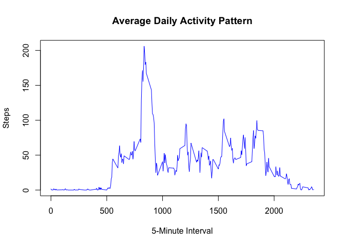

## Loading and preprocessing the data
1. Load the data (i.e. read.csv())
2. Process/transform the data (if necessary) into a format suitable for your analysis

```r
activityData <- read.csv("./activity.csv")
summary(activityData)
```

```
##      steps                date          interval     
##  Min.   :  0.00   2012-10-01:  288   Min.   :   0.0  
##  1st Qu.:  0.00   2012-10-02:  288   1st Qu.: 588.8  
##  Median :  0.00   2012-10-03:  288   Median :1177.5  
##  Mean   : 37.38   2012-10-04:  288   Mean   :1177.5  
##  3rd Qu.: 12.00   2012-10-05:  288   3rd Qu.:1766.2  
##  Max.   :806.00   2012-10-06:  288   Max.   :2355.0  
##  NA's   :2304     (Other)   :15840
```


## What is mean total number of steps taken per day?
For this part of the assignment, you can ignore the missing values in the dataset.

1. Calculate the total number of steps taken per day

```r
stepsPerDay <- aggregate(steps ~ date, activityData, sum, na.rm=TRUE)
stepsPerDay
```

```
##          date steps
## 1  2012-10-02   126
## 2  2012-10-03 11352
## 3  2012-10-04 12116
## 4  2012-10-05 13294
## 5  2012-10-06 15420
## 6  2012-10-07 11015
## 7  2012-10-09 12811
## 8  2012-10-10  9900
## 9  2012-10-11 10304
## 10 2012-10-12 17382
## 11 2012-10-13 12426
## 12 2012-10-14 15098
## 13 2012-10-15 10139
## 14 2012-10-16 15084
## 15 2012-10-17 13452
## 16 2012-10-18 10056
## 17 2012-10-19 11829
## 18 2012-10-20 10395
## 19 2012-10-21  8821
## 20 2012-10-22 13460
## 21 2012-10-23  8918
## 22 2012-10-24  8355
## 23 2012-10-25  2492
## 24 2012-10-26  6778
## 25 2012-10-27 10119
## 26 2012-10-28 11458
## 27 2012-10-29  5018
## 28 2012-10-30  9819
## 29 2012-10-31 15414
## 30 2012-11-02 10600
## 31 2012-11-03 10571
## 32 2012-11-05 10439
## 33 2012-11-06  8334
## 34 2012-11-07 12883
## 35 2012-11-08  3219
## 36 2012-11-11 12608
## 37 2012-11-12 10765
## 38 2012-11-13  7336
## 39 2012-11-15    41
## 40 2012-11-16  5441
## 41 2012-11-17 14339
## 42 2012-11-18 15110
## 43 2012-11-19  8841
## 44 2012-11-20  4472
## 45 2012-11-21 12787
## 46 2012-11-22 20427
## 47 2012-11-23 21194
## 48 2012-11-24 14478
## 49 2012-11-25 11834
## 50 2012-11-26 11162
## 51 2012-11-27 13646
## 52 2012-11-28 10183
## 53 2012-11-29  7047
```

2. If you do not understand the difference between a histogram and a barplot, research the difference between them. Make a histogram of the total number of steps taken each day

```r
hist(stepsPerDay$steps, main = "Total Number of Steps Taken Each Day"
     ,xlab = "Number of Steps"
     ,col = "blue")
```

<!-- -->

3. Calculate and report the mean and median of the total number of steps taken per day

mean

```r
meanStepsPerDay <- mean(stepsPerDay$steps)
meanStepsPerDay
```

```
## [1] 10766.19
```
median

```r
medianStepsPerDay <- median(stepsPerDay$steps)
medianStepsPerDay
```

```
## [1] 10765
```


## What is the average daily activity pattern?
1. Make a time series plot (i.e. type = "l") of the 5-minute interval (x-axis) and the average number of steps taken, averaged across all days (y-axis)

```r
stepsPerInterval<-aggregate(steps~interval, data=activityData, mean, na.rm=TRUE)
plot(stepsPerInterval 
     ,xlab = "5-Minute Interval"
     ,ylab = "Steps"
     ,main = "Average Daily Activity Pattern"
     ,col = "blue"
     ,type = "l")
```

<!-- -->

2. Which 5-minute interval, on average across all the days in the dataset, contains the maximum number of steps?

```r
maxStepsInterval <- stepsPerInterval[which.max(stepsPerInterval$steps),]$interval
maxStepsInterval
```

```
## [1] 835
```


## Imputing missing values
Note that there are a number of days/intervals where there are missing values (coded as NA). The presence of missing days may introduce bias into some calculations or summaries of the data.

1. Calculate and report the total number of missing values in the dataset (i.e. the total number of rows with NAs)

```r
totalMissingValues <- sum(is.na(activityData$steps))
totalMissingValues
```

```
## [1] 2304
```

2. Devise a strategy for filling in all of the missing values in the dataset. The strategy does not need to be sophisticated. For example, you could use the mean/median for that day, or the mean for that 5-minute interval, etc.

Strategy : Filled in all the missing values in the dataset with the mean per interval.

```r
meanStepsPerInterval <- tapply(activityData$steps, activityData$interval, mean, na.rm = TRUE)
# split activity data by interval
splitActivityData <- split(activityData, activityData$interval)
# fill in missing data for each interval
for(i in 1:length(splitActivityData)){
    splitActivityData[[i]]$steps[is.na(splitActivityData[[i]]$steps)] <- meanStepsPerInterval[i]
}
```

3. Create a new dataset that is equal to the original dataset but with the missing data filled in.

```r
imputedActivityData <- do.call("rbind", splitActivityData)
imputedActivityData <- imputedActivityData[order(imputedActivityData$date) ,]
```

4. Make a histogram of the total number of steps taken each day and Calculate and report the mean and median total number of steps taken per day. Do these values differ from the estimates from the first part of the assignment? What is the impact of imputing missing data on the estimates of the total daily number of steps?

```r
imputedStepsPerDay <- aggregate(steps ~ date, imputedActivityData, sum, na.rm=TRUE)
hist(imputedStepsPerDay$steps, main = "Total Number of Steps Taken Each Day"
     ,xlab = "Number of Steps"
     ,col = "blue")
```

<!-- -->

Imputed mean

```r
imputedMeanStepsPerDay <- mean(stepsPerDay$steps)
imputedMeanStepsPerDay
```

```
## [1] 10766.19
```

Imputed median

```r
meanStepsPerDay <- mean(stepsPerDay$steps)
meanStepsPerDay
```

```
## [1] 10766.19
```
* The values for the mean total number of steps taken per day are the same for both the original and imputed data sets at 10766.19. Meaning imputing the data had no effect on the mean value. However, the median value differs between the two just slightly as the original value is equal to 10765 while the imputed median is equal to 10766.19. Meaning that imputing caused a 1.19 difference between the original value and imputed value.


## Are there differences in activity patterns between weekdays and weekends?
For this part the weekdays() function may be of some help here. Use the dataset with the filled-in missing values for this part.

1. Create a new factor variable in the dataset with two levels – “weekday” and “weekend” indicating whether a given date is a weekday or weekend day.

```r
imputedActivityData$day <- ifelse(weekdays(as.Date(imputedActivityData$date)) == "Saturday" | weekdays(as.Date(imputedActivityData$date)) == "Sunday", "weekend", "weekday")

stepsByDay <- aggregate(imputedActivityData$steps ~ imputedActivityData$interval + imputedActivityData$day, imputedActivityData, mean, na.rm = TRUE)
```

2. Make a panel plot containing a time series plot (i.e. type = "l") of the 5-minute interval (x-axis) and the average number of steps taken, averaged across all weekday days or weekend days (y-axis). See the README file in the GitHub repository to see an example of what this plot should look like using simulated data.

```r
names(stepsByDay) <- c("interval", "day", "steps")
library(lattice)
xyplot(steps ~ interval | day, stepsByDay, type = "l", layout = c(1, 2)
    ,main = "Average Daily Activity Pattern"
    ,col = "blue"
    ,xlab = "Interval" 
    ,ylab = "Number of Steps")
```

<!-- -->


